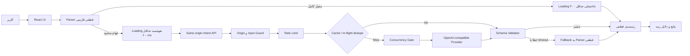

# معماری سیستم ترب مچ

## نمای کلی

ترب مچ یک برنامهٔ React است که جست‌وجوی زبان طبیعی را به معیارهای قابل‌ویرایش تبدیل می‌کند و سپس دوره‌های مستند را با منطق قطعی و توضیح‌پذیر رتبه‌بندی می‌کند. مدل زبانی یک وابستگی حیاتی نیست؛ فقط ابهام‌های باقی‌مانده از parser محلی را تکمیل می‌کند.

## اجزای سیستم

### رابط React

- صفحهٔ خانه متن آزاد را دریافت می‌کند.
- پس از هر جست‌وجو loading نمایش داده می‌شود؛ مسیر محلی حداقل ۳۰۰ میلی‌ثانیه و مسیر هوشمند حداقل ۶۰۰ میلی‌ثانیه و تا پایان پاسخ ادامه دارد.
- نتیجهٔ قبلی هنگام تحلیل نمایش داده نمی‌شود؛ بنابراین مقادیر اولیه و نهایی چشمک نمی‌زنند.
- شناسهٔ هر جست‌وجو مانع می‌شود پاسخ دیرهنگام یک درخواست قدیمی، نتیجهٔ جست‌وجوی جدیدتر را بازنویسی کند.
- منشأ هر معیار در صفحهٔ نتایج مشخص است: «از متن شما»، «تکمیل هوشمند» یا «مقدار اولیه».
- فیلترها، مقایسه و رتبه‌بندی پس از دریافت معیارهای نهایی کاملاً محلی اجرا می‌شوند.

### Parser قطعی

- اعداد فارسی و نوشتاری، بودجه، ساعت، مهلت، مهارت، نفی و مترادف‌های RAG را استخراج می‌کند.
- مقدار قطعی parser هرگز با پیشنهاد مدل بازنویسی نمی‌شود.
- اگر همهٔ معیارهای لازم مشخص باشند، هیچ درخواست مدل زبانی ارسال نمی‌شود.

### Intent API هم‌مبدأ

- کلید API فقط در سرور و فایل محلی `.env` قرار دارد.
- مرورگر فقط `/api/intent/enhance` را می‌بیند و هیچ‌گاه کلید provider را دریافت نمی‌کند.
- ورودی به ۱٬۰۰۰ نویسه و بدنهٔ درخواست به ۱۶ کیلوبایت محدود است.
- درخواست مرورگر با Origin متفاوت رد می‌شود؛ ابزار خط فرمان بدون هدر Origin همچنان برای آزمون قابل استفاده است.

### Cache و کنترل هم‌زمانی

- cache فقط در حافظه است و با restart پاک می‌شود.
- کلید cache از هش متن نرمال‌شده، ابهام‌ها، مدل و نسخهٔ prompt ساخته می‌شود؛ متن خام در کلید یا log ذخیره نمی‌شود.
- مقدار پیش‌فرض TTL برابر ۲۴ ساعت و ظرفیت برابر ۵۰۰ نتیجه است.
- فقط خروجی موفق و اعتبارسنجی‌شده cache می‌شود؛ خطا و timeout ذخیره نمی‌شوند.
- درخواست‌های هم‌زمان یکسان به یک فراخوانی provider تبدیل می‌شوند.
- حداکثر دو فراخوانی provider هم‌زمان اجرا و حداکثر ۲۰ درخواست در صف نگه داشته می‌شود.

### Rate limit و حفظ هزینه

- مقدار پیش‌فرض برای هر IP برابر ۱۰ درخواست در ۶۰ ثانیه است.
- عبور از حد با `429` و هدر `Retry-After` پاسخ داده می‌شود.
- پاسخ موفق هدرهای cache، زمان سرور و هزینهٔ تخمینی همان درخواست را دارد.
- log متریک فقط وضعیت cache، latency، توکن‌ها و هزینهٔ تخمینی را ثبت می‌کند؛ متن جست‌وجو و کلید API ثبت نمی‌شوند.

### اعتبارسنجی و fallback

- پاسخ provider باید JSON معتبر، مسیر فیلد شناخته‌شده، مقدار مجاز و confidence بین صفر و یک داشته باشد.
- خروجی نامعتبر پیش از cache رد می‌شود.
- timeout، قطع شبکه، پاسخ نامعتبر، صف پر یا خطای provider رتبه‌بندی را متوقف نمی‌کند.
- در خطا، UI پیام شفاف نشان می‌دهد و نتیجه با parser قطعی ادامه پیدا می‌کند.

## جریان یک جست‌وجو

1. متن کاربر در مرورگر نرمال و با parser تحلیل می‌شود.
2. loading محلی بلافاصله نمایش داده می‌شود؛ اگر ابهامی وجود نداشته باشد، نتیجه پس از حداقل ۳۰۰ میلی‌ثانیه نمایش داده می‌شود.
3. اگر ابهام قابل‌تکمیل وجود داشته باشد، loading هوشمند حداقل ۶۰۰ میلی‌ثانیه و تا پایان پاسخ باقی می‌ماند.
4. API ابتدا Origin، اندازهٔ ورودی و rate limit را بررسی می‌کند.
5. cache و درخواست‌های در حال اجرا بررسی می‌شوند.
6. فقط در cache miss، فراخوانی محدودشدهٔ provider انجام می‌شود.
7. خروجی با schema و قواعد دامنه اعتبارسنجی می‌شود.
8. معیار معتبر با منشأ `llm` ادغام می‌شود؛ مقدار قطعی parser تغییر نمی‌کند.
9. در هر خطا، همان تحلیل قطعی مرحلهٔ اول استفاده می‌شود.
10. رتبه‌بندی و توضیح دلایل در مرورگر محاسبه و نمایش داده می‌شود.

## تنظیمات عملیاتی

| متغیر | مقدار پیش‌فرض | کاربرد |
|---|---:|---|
| `TOROB_MATCH_INTENT_CACHE_TTL_MS` | `86400000` | اعتبار cache |
| `TOROB_MATCH_INTENT_CACHE_MAX_ENTRIES` | `500` | حداکثر نتایج cache |
| `TOROB_MATCH_INTENT_RATE_LIMIT` | `10` | درخواست مجاز هر IP |
| `TOROB_MATCH_INTENT_RATE_WINDOW_MS` | `60000` | پنجرهٔ rate limit |
| `TOROB_MATCH_INTENT_MAX_CONCURRENT` | `2` | فراخوانی هم‌زمان provider |
| `TOROB_MATCH_INTENT_MAX_QUEUE` | `20` | حداکثر صف انتظار |
| `TOROB_MATCH_INTENT_METRICS_ENABLED` | `true` | متریک‌های بدون متن کاربر |

## راهبرد آزمون

- تست واحد parser، ادغام مدل و provenance معیارها را می‌سنجد.
- تست سرور TTL/LRU cache، اشتراک درخواست در حال اجرا، rate limit، صف و محاسبهٔ هزینه را پوشش می‌دهد.
- تست مرورگری با provider ساختگی، loading، پاسخ موفق، timeout، JSON نامعتبر و عدم فراخوانی غیرضروری مدل را در دسکتاپ و موبایل بررسی می‌کند.
- هیچ تست CI به API واقعی متصل نمی‌شود و هزینه ایجاد نمی‌کند.
- ارزیابی واقعی مدل فقط با فرمان صریح `npm run test:intent-llm` اجرا می‌شود.

## مرز مسئولیت AI

مدل زبانی فقط پیشنهاد ساختاریافته تولید می‌کند. تصمیم نهایی دربارهٔ اعتبار فیلد، ادغام با معیارهای قطعی، رتبه‌بندی دوره‌ها و توضیح نتیجه در کد قابل‌آزمون باقی می‌ماند. این جداسازی باعث می‌شود پروژه بدون اینترنت، بدون API Key یا با provider جایگزین همچنان کار کند.
